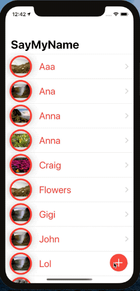

# Friends Meetup

**#100DaysOfSwiftUI Days 77-78, Challenge #5: https://www.hackingwithswift.com/guide/ios-swiftui/6/3/challenge**

 

## Day 77

Have you ever been to a conference or a meetup, chatted to someone new, then realized seconds after you walk away that you’ve already forgotten their name? You’re not alone, and the app you’re building today will help solve that problem and others like it.

Your goal is to build an app that asks users to import a picture from their photo library, then attach a name to whatever they imported. The full collection of pictures they name should be shown in a List, and tapping an item in the list should show a detail screen with a larger version of the picture.

Breaking it down, you should:

Wrap UIImagePickerController so it can be used to select photos.
Detect when a new photo is imported, and immediately ask the user to name the photo.
Save that name and photo somewhere safe.
Show all names and photos in a list, sorted by name.
Create a detail screen that shows a picture full size.
Decide on a way to save all this data.

## Day 78 - MapKit & CoreLocation

Yesterday you built a new app that imports photos from the user’s library, and hopefully you’re pleased with the finished product – or at least making great progress towards the finished product.

But your boss has come in and demanded a new feature: when you’re viewing a picture that was imported, you should show a map with a pin on that marked where they were when that pin was added. It might be on the same screen side by side with the photo, it might be shown or hidden using a segmented control, or perhaps it’s on a different screen – it’s down to you. Regardless, you know how to drop pins, and you also know how to use the center coordinate of map views, so the only thing left to figure out is how to get the user’s location to save alongside their text and image.
